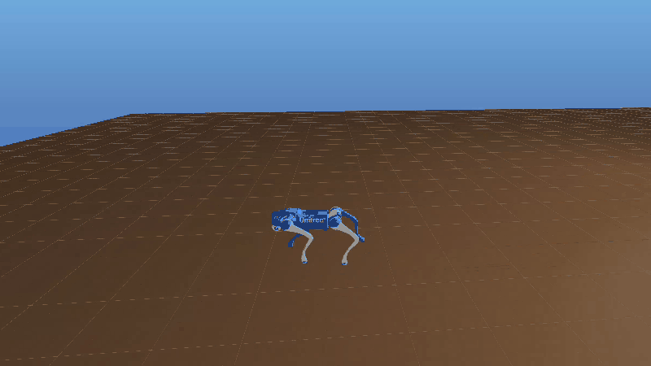
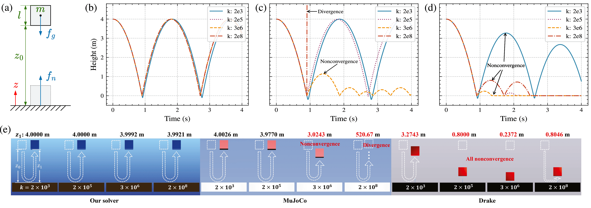
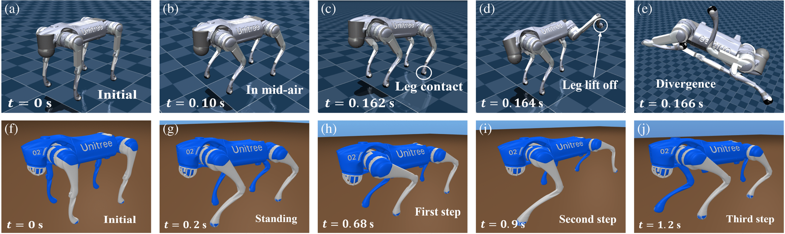

<div align="center">

# Sire

### 面向高刚度接触、机器人仿真与强化学习的开源多体动力学引擎

[](https://isocpp.org/)
[](https://cmake.org/)
[](python/)
[](https://doi.org/10.1109/LRA.2026.3692328)
[](LICENSE.txt)

[快速开始](#快速开始) · [核心能力](#核心能力) · [效果展示](#效果展示) · [强化学习](#强化学习) · [引用](#引用)

</div>

## 项目简介

**Sire** 是一个面向机器人与多体系统研究的开源动力学仿真引擎。项目覆盖建模、运动学与动力学、几何碰撞、连续接触求解、数值积分、可视化及 Python 接口，并提供从批量强化学习训练到 Sire–MuJoCo sim2sim 验证的完整工作流。

Sire 的核心研究成果发表于 IEEE Robotics and Automation Letters：

> **A Convergent Continuous Contact Solver With Explicit Separation Time for High-Stiffness Contact**

该方法通过解析描述接触穿透动力学并显式确定分离时间，为高刚度连续接触提供收敛求解；论文实验覆盖弹跳物体、初始穿透消除和四足机器人运动，并验证了最高至 \(10^{30}\,\mathrm{N/m}\) 刚度下的求解能力。详情见[论文页面](https://doi.org/10.1109/LRA.2026.3692328)。

> Sire 当前主要面向科研、算法验证与机器人仿真开发。

## 核心能力

| 模块 | 能力 |
| --- | --- |
| 多体建模 | 刚体、关节、约束、执行器、传感器与控制器建模 |
| 运动学与动力学 | 位姿、速度、雅可比、质量矩阵及系统动力学计算 |
| 几何与碰撞 | 基于 COAL / hpp-fcl 的碰撞检测与接触几何查询 |
| 连续接触求解 | 显式分离时间、高刚度接触、初始穿透处理与摩擦接触 |
| 仿真执行 | 事件驱动的物理推进、碰撞与约束求解、状态记录及回放 |
| Python 与可视化 | Python 绑定、MeshCat 可视化及可脚本化实验 |
| 强化学习 | 原生 C++ 批量步进器、持久线程池、多环境 PPO 训练和 sim2sim 验证 |

## 快速开始

### 依赖

- Linux 或 Windows，支持 C++17 的编译器，CMake ≥ 3.18
- ARIS、Eigen3、COAL / hpp-fcl、Assimp、stduuid
- Python 绑定与强化学习为可选功能

### 编译

```bash
git clone --recursive https://github.com/nocodenopain/sire.git
cd sire

cmake -S . -B build -DCMAKE_BUILD_TYPE=Release \
  -DTARGET_ARIS_PATH=/path/to/aris/install \
  -DTARGET_HPP_FCL_PATH=/path/to/hpp-fcl/install \
  -DTARGET_STDUUID_PATH=/path/to/stduuid/install
cmake --build build --parallel
```

如需 Python 接口，在配置时加入 `-DBUILD_PYTHON=ON`；如需编译 C++ 示例，加入 `-DBUILD_DEMO=ON`。依赖路径请替换为本机安装位置。

## 效果展示

### GO2 强化学习控制

<p align="center">
  <a href="docs/media/go2-sire-demo.webm">
    
  </a>
</p>

<p align="center">
  <sub>GO2 策略在 Sire 中的可视化运行效果。点击动图可查看完整 WebM 录屏。</sub>
</p>

### 论文实验

<p align="center">
  
</p>

<p align="center">
  <sub><strong>Fig. 5 — 高刚度多点接触。</strong> 弹跳盒实验对比 Sire、MuJoCo 与 Drake 在接触刚度持续提高时的轨迹和接触表现。</sub>
</p>

<p align="center">
  
</p>

<p align="center">
  <sub><strong>Fig. 8 — GO2 高刚度 sim2sim。</strong> 同一 Isaac Gym 策略分别部署到 MuJoCo 与 Sire；在相同的高刚度接触参数下，Sire 保持稳定运动。</sub>
</p>

<p align="center">
  <a href="https://doi.org/10.1109/LRA.2026.3692328">论文全文</a> ·
  <a href="demo/demo_paper/">实验数据与绘图</a> ·
  <a href="demo/demo_python/">Python 与机器人示例</a>
</p>

## 强化学习

Sire 通过 **pybind11** 提供 Python 接口，可作为 PPO 等强化学习算法的物理仿真后端。项目在此基础上实现了原生 C++ 批量步进和持久化多线程并行，使多个相互独立的环境能够在 CPU 上高效推进，减少了逐环境 Python 调用、线程重复创建和临时数据分配的开销，同时完整保留 Sire 原有的积分、碰撞检测、接触与约束求解能力，适合大规模并行 rollout 和机器人策略训练。

当前仓库提供 GO2 平地训练、PPO 接入、批量仿真及 Sire–MuJoCo sim2sim 验证。安装、训练和策略导出方法见 [`SireRLGym 使用说明`](demo/demo_python/SireRLGym/README.md)。

## 引用

如果 Sire 或仓库中的论文实验对你的研究有帮助，请引用：

```bibtex
@article{lei2026convergent,
  author  = {Tianjian Lei and Junpeng Chen and Qifei Li and Jian S. Dai and Yang Pan},
  title   = {A Convergent Continuous Contact Solver With Explicit Separation Time for High-Stiffness Contact},
  journal = {IEEE Robotics and Automation Letters},
  year    = {2026},
  volume  = {11},
  number  = {7},
  pages   = {8323--8330},
  doi     = {10.1109/LRA.2026.3692328}
}
```

## 许可证

本项目基于 [MIT License](LICENSE.txt) 开源。
